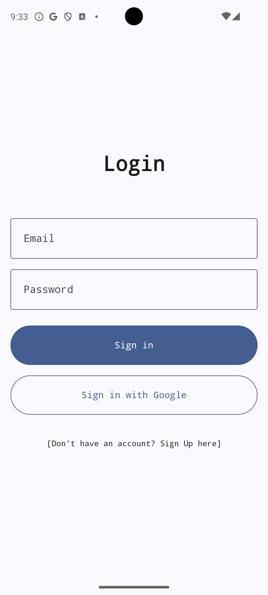
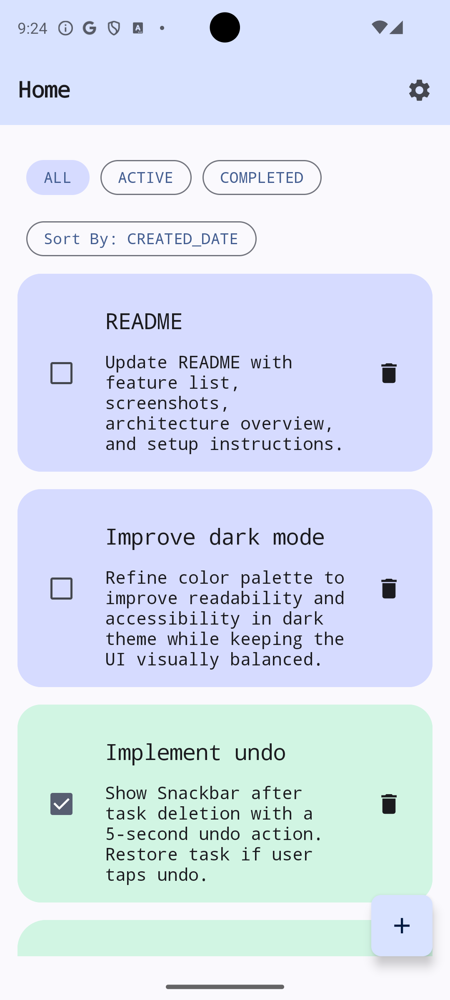
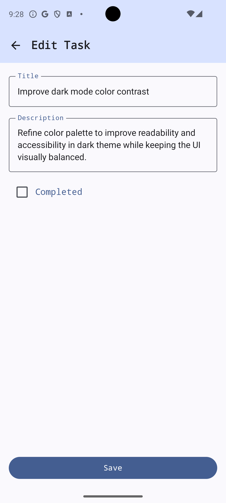

# TaskManager Pro

TaskManager Pro is a modern Android task management app built with Kotlin, Jetpack Compose, and Firebase. 
It is designed as a production-quality portfolio project, showcasing clean architecture, scalable state management, and polished UI/UX.

---

## 📸 Screenshots

  
  
  

## 🎥 Demo

  

## Tech Stack
- Kotlin
- Jetpack Compose, Material 3
- MVVM + Clean Architecture
- Firebase Authentication (Email & Google Sign-In)
- Cloud Firestore
- Hilt (Dependency Injection)
- Coroutines + Flow

## Highlights
- Clean Architecture (UI / Domain / Data)
- Firebase-backed real-time sync
- Modern Material 3 + Compose UI
- Smooth animations and meaningful empty states
- User-scoped data with Firestore security rules

---

## Features

### Authentication
- Email & password sign-up / sign-in
- Google Sign-In
- Proper auth state handling across app restarts

### Task Management
- Create, edit, delete tasks
- Mark tasks as completed
- Undo delete via Snackbar
- User-scoped tasks stored in Firestore

### UI & UX
- Jetpack Compose + Material 3
- Light & dark theme support
- Animated transitions between states
- Empty and loading states with contextual messaging

### Filters & Sorting
- Filter by: All / Active / Completed
- Sort by: Created date / Updated date / Title

### Settings
- Theme selection (Light / Dark / System)
- Sign out

---

## Firestore Security
- Tasks are scoped per authenticated user
- Users can only read/write their own tasks
- Firestore rules enforce request.auth.uid

## 📌 Project Status
✅ **Complete**

Core features and UI polish are complete.  
This project is considered feature-complete and maintained for improvements or bug fixes if needed.

## 📄 License
This project is licensed under the MIT License.